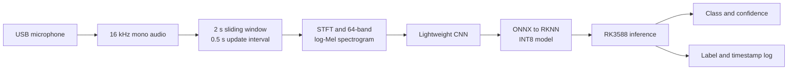

# Real-Time Urban Sound Classification on RK3588

An ELEC5305 project for privacy-preserving, real-time environmental sound classification using log-Mel spectrograms, a lightweight convolutional neural network (CNN), and INT8 inference on the RK3588 platform.

> Project status: proposal and initial implementation stage.

[Read the full project proposal](docs/ELEC5305_Project_Proposal_Mingze_Li.pdf)

## Project Overview

Urban monitoring systems often depend on cameras or cloud processing, which can increase bandwidth usage and expose sensitive data. This project instead processes microphone audio locally on an RK3588 board. The system will classify the ten UrbanSound8K sound categories, display the predicted class and confidence, and record only event labels and timestamps rather than transmitting raw audio.

The project compares a conventional MFCC-SVM baseline with a compact CNN trained on log-Mel spectrograms. The selected CNN will be exported through ONNX, converted to RKNN, quantised to INT8, and evaluated on the RK3588 under a real-time streaming workload.

## Objectives

- Build a reproducible UrbanSound8K preprocessing and fold-based evaluation pipeline.
- Establish an MFCC-SVM baseline for environmental sound classification.
- Train a lightweight CNN using log-Mel spectrogram inputs.
- Study the effect of time-domain and spectrogram augmentation.
- Convert and quantise the selected model for RK3588 deployment.
- Demonstrate live USB microphone inference with bounded latency.
- Compare accuracy, latency, throughput, and model size across deployment formats.

## Proposed System



### Audio Preprocessing

| Parameter | Proposed setting |
| --- | --- |
| Sample format | 16 kHz, mono |
| Input window | 2 seconds |
| Window update | Every 0.5 seconds |
| STFT window | 25 ms Hann window |
| STFT frame hop | 10 ms |
| FFT size | 512 points |
| Spectrogram | 64 Mel bands with log compression |
| Normalisation | Per-band statistics fitted on training data only |

Short clips will be zero-padded. Longer clips will be segmented without mixing samples from different official dataset folds.

### Models

**Baseline:** 20 mel-frequency cepstral coefficients (MFCCs), summarised using temporal mean and standard deviation, followed by a support vector machine (SVM).

**Proposed model:** a compact CNN built from depthwise-separable convolution blocks, global average pooling, and a ten-class softmax output layer. Training will use class-balanced sampling, cross-entropy loss, and validation macro F1 for model selection.

### Training and Augmentation

Training will be implemented in PyTorch. Planned augmentation includes:

- Random time shifts
- Gain variation
- Time-frequency masking based on SpecAugment

The ablation study will compare no augmentation, time-domain augmentation, spectrogram masking, and their combination.

## Dataset and Evaluation

The project uses [UrbanSound8K](https://urbansounddataset.weebly.com/urbansound8k.html), which contains 8,732 labelled audio clips arranged into ten predefined folds. The official folds will be preserved to keep evaluation reproducible and avoid data leakage.

The ten target classes are:

1. Air conditioner
2. Car horn
3. Children playing
4. Dog bark
5. Drilling
6. Engine idling
7. Gun shot
8. Jackhammer
9. Siren
10. Street music

Evaluation will report:

- Accuracy and macro F1 across the ten held-out folds
- Per-class recall and confusion matrices
- Model size and throughput
- P50 and P95 preprocessing-plus-inference latency
- Accuracy change after INT8 quantisation
- Desktop FP32 versus RK3588 INT8 predictions on the same test clips

### Success Criteria

| Metric | Target |
| --- | --- |
| Macro F1 | At least 0.70 |
| INT8 accuracy loss | Less than 3 percentage points from FP32 |
| RK3588 P95 latency | Less than the 0.5-second update interval |
| Prototype behaviour | Ten-class streaming inference from a USB microphone |

## Experimental Questions

1. How much does the log-Mel CNN improve macro F1 over the MFCC-SVM baseline under the same fold-based evaluation?
2. Which augmentation settings improve generalisation without masking class-specific acoustic cues?
3. How much accuracy is lost after INT8 conversion, and does the quantised model meet the RK3588 streaming deadline?

## Planned Repository Structure

```text
.
|-- configs/              # Experiment and deployment configurations
|-- data/                 # Local dataset location (not committed)
|-- docs/                 # Proposal and project documentation
|-- models/               # Exported model artifacts
|-- scripts/              # Training, evaluation, conversion, and demo entry points
|-- src/
|   |-- data/             # Dataset loading and preprocessing
|   |-- features/         # MFCC and log-Mel feature extraction
|   |-- models/           # SVM and lightweight CNN definitions
|   |-- deployment/       # ONNX/RKNN conversion and RK3588 inference
|   `-- streaming/        # Microphone capture and live prediction
|-- tests/                # Automated tests
`-- README.md
```

This structure is planned and will be populated as implementation progresses.

## Timeline

| Weeks | Task and output |
| --- | --- |
| 1-2 | Confirm scope, create the public repository, and reproduce the UrbanSound8K data pipeline. |
| 3-4 | Review environmental sound classification methods and implement STFT, log-Mel, and MFCC features. |
| 5 | Train and evaluate the MFCC-SVM baseline. |
| 6-8 | Implement the lightweight CNN, tune training, and add augmentation. |
| 9 | Run fold-based evaluation and analyse the confusion matrix. |
| 10 | Export the model, perform INT8 calibration, and convert it to RKNN. |
| 11 | Deploy the streaming prototype and benchmark latency, throughput, and model size. |
| 12 | Complete results, figures, README instructions, and the demonstration. |
| 13 | Finalise the report, GitHub Pages site, and repository release. |

## Expected Deliverables

- Reproducible preprocessing and feature extraction code
- MFCC-SVM baseline and lightweight CNN training pipelines
- Evaluation scripts and saved model files
- ONNX export, RKNN conversion, and INT8 calibration workflow
- RK3588 USB microphone streaming prototype
- Accuracy, latency, throughput, and model-size benchmarks
- Setup instructions and a short demonstration
- Final report and GitHub Pages project site

## References

1. J. Salamon, C. Jacoby, and J. P. Bello, "A Dataset and Taxonomy for Urban Sound Research," *Proceedings of the 22nd ACM International Conference on Multimedia*, 2014. [https://doi.org/10.1145/2647868.2655045](https://doi.org/10.1145/2647868.2655045)
2. K. J. Piczak, "Environmental Sound Classification with Convolutional Neural Networks," *2015 IEEE 25th International Workshop on Machine Learning for Signal Processing*, 2015. [https://doi.org/10.1109/MLSP.2015.7324337](https://doi.org/10.1109/MLSP.2015.7324337)
3. M. Sandler, A. Howard, M. Zhu, A. Zhmoginov, and L.-C. Chen, "MobileNetV2: Inverted Residuals and Linear Bottlenecks," *2018 IEEE/CVF Conference on Computer Vision and Pattern Recognition*, 2018. [https://doi.org/10.1109/CVPR.2018.00474](https://doi.org/10.1109/CVPR.2018.00474)
4. D. S. Park et al., "SpecAugment: A Simple Data Augmentation Method for Automatic Speech Recognition," *Interspeech 2019*, 2019. [https://doi.org/10.21437/Interspeech.2019-2680](https://doi.org/10.21437/Interspeech.2019-2680)

## Project Information

- **Student:** Mingze Li
- **Student ID:** 550374130
- **Course:** ELEC5305
- **GitHub:** [kolentossa](https://github.com/kolentossa)
- **Repository:** [elec5305-project-550374130](https://github.com/kolentossa/elec5305-project-550374130)
- **GitHub Pages:** [Project site](https://kolentossa.github.io/elec5305-project-550374130/)
