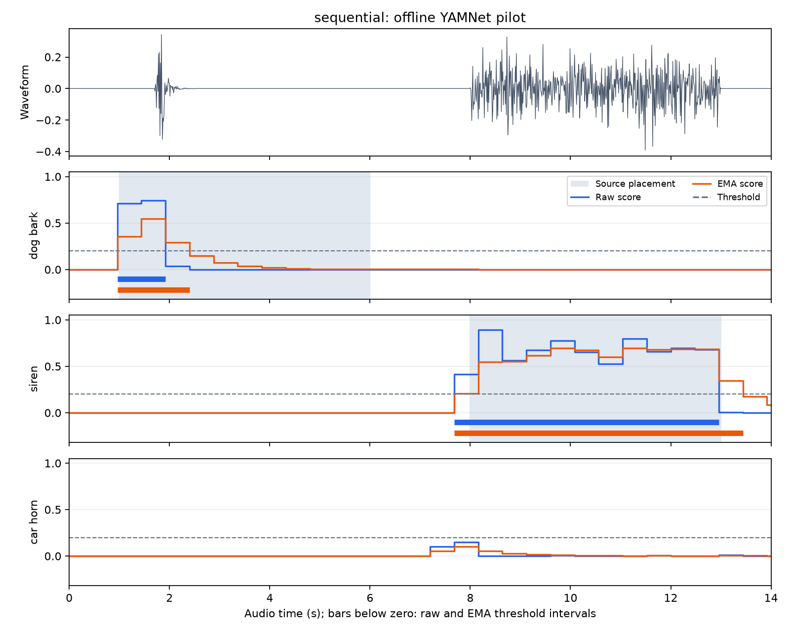
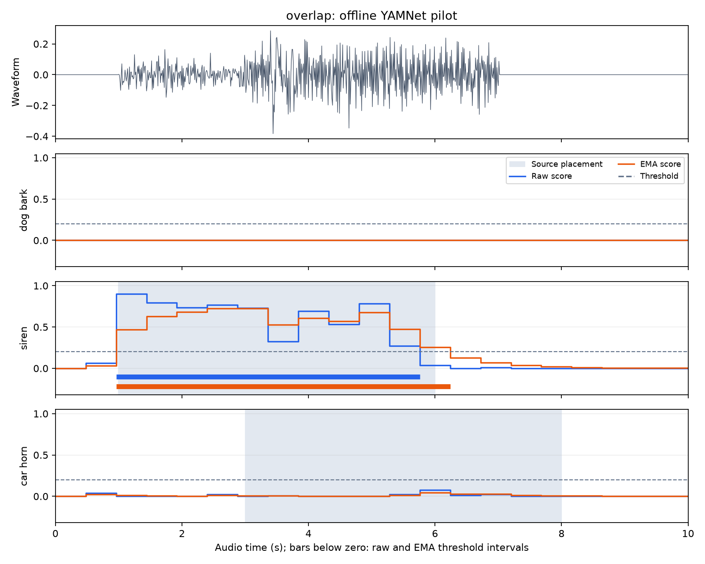

# Initial implementation and testing

9 October 2026 | Mingze Li | Student ID 550374130 | ELEC5305

The project now tests prerecorded WAV files using YAMNet on the RK3588 NPU and Windows CPU. Six controlled scenes produce time-varying scores and nominal intervals for three classes. Both backends achieved recording-level micro precision 100.0% and recall 85.7% on this pilot, with the mixed-scene horn missed.

[Project homepage](https://kolentossa.github.io/elec5305-project-550374130/) | [Submission PDF](submission/ELEC5305_Initial_Implementation_Mingze_Li_550374130.pdf) | [Repository](https://github.com/kolentossa/elec5305-project-550374130)

## Project direction

I am investigating how to convert pretrained YAMNet scores into stable urban sound event detections. The implementation processes prerecorded WAV files on RK3588 and reports sound classes and nominal event intervals. The research question concerns the trade-off between false alarms, missed labels, fragmentation and event boundary error when scores are processed over time.

The original proposal's CNN training plan has been revised to focus on temporal decisions using a pretrained model. The current pilot covers dog barking, sirens and car horns. A complete mapping to URBAN-SED's ten classes remains to be implemented.

## What has been implemented

The [earlier inference experiment](first_run.md) retained all six patches and 521 class scores from Rockchip's three-second YAMNet model on Windows CPU and RK3588 CPU/NPU. Windows CPU and RK3588 NPU had mean absolute score difference 0.001982 and top-1 agreement on five of six patches on the official sample. These are numerical diagnostics on one sample, not detection accuracy. [Board setup and logs](rk3588_setup.md) remain available.

The new code is deliberately small:

| File | Purpose |
| --- | --- |
| [prepare_pilot_audio.py](https://github.com/kolentossa/elec5305-project-550374130/blob/main/scripts/prepare_pilot_audio.py) | Download three fixed source recordings, resample to 16 kHz and construct six scenes |
| [pilot_detection.py](https://github.com/kolentossa/elec5305-project-550374130/blob/main/scripts/pilot_detection.py) | Infer the complete scenes, apply thresholding and smoothing, and save scores, intervals and plots |
| [rknn_backend.py](https://github.com/kolentossa/elec5305-project-550374130/blob/main/scripts/rknn_backend.py) | Open the converted YAMNet model with the prepared RK3588 runtime |
| [plot_pilot_results.py](https://github.com/kolentossa/elec5305-project-550374130/blob/main/scripts/plot_pilot_results.py) | Render saved board score files on the PC |
| [evaluate_pilot.py](https://github.com/kolentossa/elec5305-project-550374130/blob/main/scripts/evaluate_pilot.py) | Compare inserted source labels with labels producing at least one interval per scene |
| [test_pilot_detection.py](https://github.com/kolentossa/elec5305-project-550374130/blob/main/tests/test_pilot_detection.py) | Check event grouping, causal smoothing, window coverage and tail padding |

The six scenes were run on **Windows ONNX Runtime CPU and the RK3588 NPU**. The board is an Embedfire LubanCat-5 V2, running the converted FP16 model on NPU core 0 with RKNN Lite/Runtime 2.3.2 and driver 0.9.8. Both backends use the same scene windowing and temporal decision code. The [NPU run record](../results/initial_pilot_rk3588_npu/run.json) stores the converted-model and runtime-library hashes; [inference.log](../results/initial_pilot_rk3588_npu/inference.log) records the actual NPU execution.

The board clock was incorrect during the 9 October session. Its native log times and `created_utc` retain 2 May 2026; the `experiment_date` records the actual session date.

## Controlled audio scenes

Three five-second ESC-50 recordings were selected before inference: the first filename alphabetically within fold 4 for each of the dog, siren and car_horn categories. The pinned ESC-50 commit is `33c8ce9eb2cf0b1c2f8bcf322eb349b6be34dbb6`. The same recordings are reused across scenes, so the six scenes are not independent examples.

| Scene | Duration | Source insertion intervals in seconds | Gain |
| --- | ---: | --- | --- |
| dog_only | 8 s | Dog 2-7 | 1.0 |
| siren_only | 8 s | Siren 2-7 | 1.0 |
| horn_only | 8 s | Horn 2-7 | 1.0 |
| sequential | 14 s | Dog 1-6; siren 8-13 | 1.0 each |
| overlap | 10 s | Siren 1-6; horn 3-8 | 0.5 each |
| silence | 8 s | No inserted source | - |

The total audio duration is **56 seconds**. These insertion intervals describe where source files were placed; they are not strong annotations of the audible events. For example, the dog recording contains a brief bark within a longer file.

Downloaded and generated audio stays under `.cache/pilot_audio/` and is excluded from Git. [manifest.json](../results/initial_pilot/manifest.json) records source URLs, hashes, sample rates, scene placements and gains.

## Inference and temporal decisions

The complete scenes are processed in three-second model windows advancing by 2.4 seconds. Each full window contributes its first five patches at a 0.48-second hop. The sixth patch is discarded because its context extends beyond that window and uses internal padding. At the scene tail, retained patches can still contain padding; these are included and flagged in the score CSVs. Each backend saved **119 patches**, including two flagged tail patches per scene.

The pilot selects three outputs from the 521-class score array:

| Pilot label | YAMNet display name | Output index |
| --- | --- | ---: |
| dog_bark | Bark | 70 |
| siren | Siren | 390 |
| car_horn | Vehicle horn, car horn, honking | 302 |

Each class is thresholded independently at **0.2**. Adjacent positive bins are joined into an interval. The second method first applies a causal exponential moving average:

`smoothed[t] = 0.5 * raw[t] + 0.5 * smoothed[t-1]`

The first smoothed value equals the first raw value. The threshold and smoothing factor are fixed illustrative defaults; they were not tuned or selected using the results.

The saved intervals use **patch-start bins**, not measured event boundaries. Each score depends on 0.975 seconds of waveform, and the model is applied in three-second windows. This experiment evaluates recorded files; the timestamps describe nominal score bins and do not establish audible event boundaries.

## Recorded-audio results

Raw and EMA produced the same counts on both backends. Their nominal intervals also agree across Windows CPU and RK3588 NPU on all six scenes:

| Scene | Patches | Raw intervals | EMA intervals | Classes reaching the threshold |
| --- | ---: | ---: | ---: | --- |
| dog_only | 17 | 1 | 1 | Dog bark |
| siren_only | 17 | 1 | 1 | Siren |
| horn_only | 17 | 1 | 1 | Car horn |
| sequential | 30 | 2 | 2 | Dog bark and siren |
| overlap | 21 | 1 | 1 | Siren only |
| silence | 17 | 0 | 0 | None |

In the sequential scene, raw dog-bark bins formed the nominal interval 0.96-1.92 s and siren bins formed 7.68-12.96 s. EMA extended the corresponding ends to 2.40 s and 13.44 s. Interval endings extended by one 0.48-second bin in the sound-bearing scenes, while interval counts stayed unchanged. This pilot therefore does not demonstrate a reduction in fragmentation.



The mixed scene is a useful failure. On RK3588 NPU, the horn's maximum raw score was **0.077698**, compared with **0.876465** in the horn-only scene. Windows CPU gave **0.079715** mixed and **0.872814** alone. The horn stayed below the 0.2 threshold on both backends, and both methods returned only a siren interval. Mixing and source amplitude changed together: each mixed source has gain 0.5, while the single-source scenes use gain 1.0. Without a half-gain horn-only control, this comparison cannot establish why the horn score fell.



[NPU run.json](../results/initial_pilot_rk3588_npu/run.json) and [CPU run.json](../results/initial_pilot/run.json) contain the environments, parameters, mapping and per-scene results. The [NPU event CSV](../results/initial_pilot_rk3588_npu/events.csv) and [CPU event CSV](../results/initial_pilot/events.csv) contain all nominal intervals. Per-scene CSVs hold the three raw and smoothed scores, timing and padding flags; NPY files retain all 521 raw class scores per patch. [NPU result files](https://github.com/kolentossa/elec5305-project-550374130/tree/main/results/initial_pilot_rk3588_npu) and [CPU reference files](https://github.com/kolentossa/elec5305-project-550374130/tree/main/results/initial_pilot).

## Recording-level precision and recall

The basic evaluation treats each scene as three recording-label decisions, giving **18 decisions** across the six scenes. A label is expected when its source recording was inserted. It is predicted when the detector produces at least one nominal interval for that label anywhere in the scene; repeated intervals count once.

Micro precision is `TP / (TP + FP)` and micro recall is `TP / (TP + FN)`, with counts summed across the scenes and labels:

| Backend | Method | TP | FP | FN | Micro precision | Micro recall |
| --- | --- | ---: | ---: | ---: | ---: | ---: |
| Windows CPU | Raw threshold | 6 | 0 | 1 | 100.0% | 85.7% |
| Windows CPU | EMA threshold | 6 | 0 | 1 | 100.0% | 85.7% |
| RK3588 NPU | Raw threshold | 6 | 0 | 1 | 100.0% | 85.7% |
| RK3588 NPU | EMA threshold | 6 | 0 | 1 | 100.0% | 85.7% |

The missed label is the horn in the mixed scene. These metrics check source-label presence in this small recorded-audio pilot. They do not evaluate event boundaries or establish performance on unseen recordings. [NPU metrics](../results/initial_pilot_rk3588_npu/metrics.json) and [CPU metrics](../results/initial_pilot/metrics.json) contain the counts and each scene's expected and predicted labels.

## Reproduce and check

Tested with Python 3.12.10 on Windows 11. From the repository root:

```powershell
python -m venv .venv
.\.venv\Scripts\python.exe -m pip install -r requirements.txt
.\.venv\Scripts\python.exe scripts/prepare_pilot_audio.py
.\.venv\Scripts\python.exe scripts/pilot_detection.py --output .cache/runs/pilot-repeat
.\.venv\Scripts\python.exe scripts/evaluate_pilot.py .cache/runs/pilot-repeat
.\.venv\Scripts\python.exe -m unittest discover -s tests -v
.\.venv\Scripts\python.exe -m pip check
```

For board setup, file transfer and the tested NPU command, see [RK3588 recorded-audio reproduction](rk3588_setup.md). Board inference can skip plots with `--no-plots`; the PC can render the saved board scores with:

```powershell
.\.venv\Scripts\python.exe scripts/plot_pilot_results.py results/initial_pilot_rk3588_npu --audio-dir .cache/pilot_audio
```

Internet access is needed for the initial source audio and model downloads. Use an ignored output folder when repeating the experiment. Six unit checks passed on both Windows and RK3588, covering separated events and an open tail, no-event input, the smoothing recurrence, nonduplicated window coverage with tail padding, multi-label metric counts and undefined metric denominators. Both project environments passed `pip check`. A fresh-download Windows CPU repeat reproduced the source manifest, six full score arrays, score CSVs and event CSV exactly. A repeated NPU run reproduced all six score arrays, event intervals and metrics exactly; CSV target columns matched the NPY arrays. [NPU verification.json](../results/initial_pilot_rk3588_npu/verification.json) records these checks. The board plots were drawn on Windows from the saved NPU scores.

## Limits and next steps

This is a controlled implementation pilot using three reused source recordings. It has no strongly annotated audible event boundaries and no URBAN-SED examples. Strongly annotated event detection accuracy and onset/offset error have not been measured. Silence here is digital zero, so its zero interval count does not establish performance on real background noise.

The next work is to add annotated URBAN-SED evaluation and complete the class mapping, then compare global and class-specific thresholds, smoothing and hysteresis. Parameters will be selected on the validation set, preserving URBAN-SED's predefined split and reserving its test set for the selected method. A half-gain control and additional mixed recordings will help examine the observed horn failure. I will test the selected method on prerecorded WAV files on RK3588 and compare its classifications and event intervals with the CPU reference.

Feedback would be helpful on the three-class starting scope, the planned temporal methods, and how best to evaluate event fragmentation and event boundary error.

## Source credits

ESC-50 was created by Karol J. Piczak. The dataset as a whole is distributed under CC BY-NC 3.0; its ESC-10 subset is distributed under CC BY 3.0. The following original-source credits are recorded in the [pinned ESC-50 LICENSE](https://github.com/karolpiczak/ESC-50/blob/33c8ce9eb2cf0b1c2f8bcf322eb349b6be34dbb6/LICENSE):

| ESC-50 file | Original creator and source | Original source terms |
| --- | --- | --- |
| 4-182395-A-0.wav | pgonsilva, [Freesound 182395](https://freesound.org/people/pgonsilva/sounds/182395/) | CC BY |
| 4-102871-A-42.wav | dobroide, [Freesound 102871](https://freesound.org/people/dobroide/sounds/102871/) | CC BY |
| 4-175845-A-43.wav | toiletrolltube, [Freesound 175845](https://freesound.org/people/toiletrolltube/sounds/175845/) | CC0 |

The preparation script resamples the clips and inserts or mixes them into longer scenes. No source or generated audio is committed. Dataset reference: K. J. Piczak, *ESC: Dataset for Environmental Sound Classification*, ACM Multimedia, 2015, [doi:10.1145/2733373.2806390](https://doi.org/10.1145/2733373.2806390).
